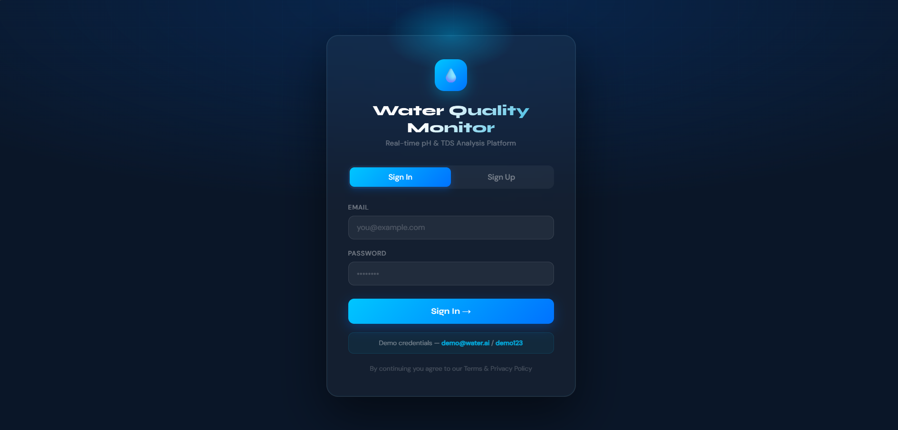
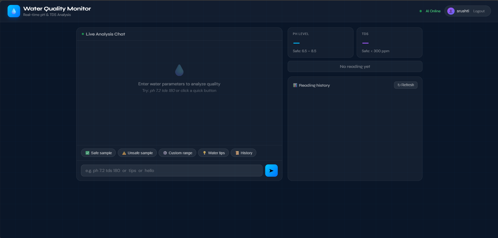
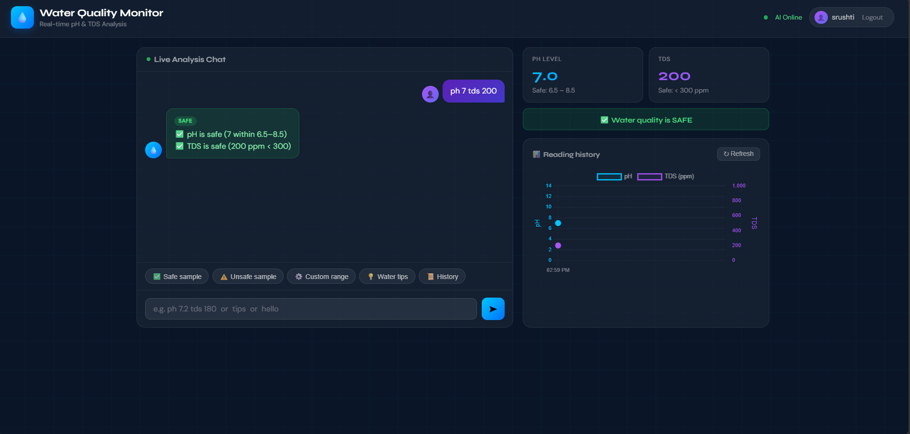
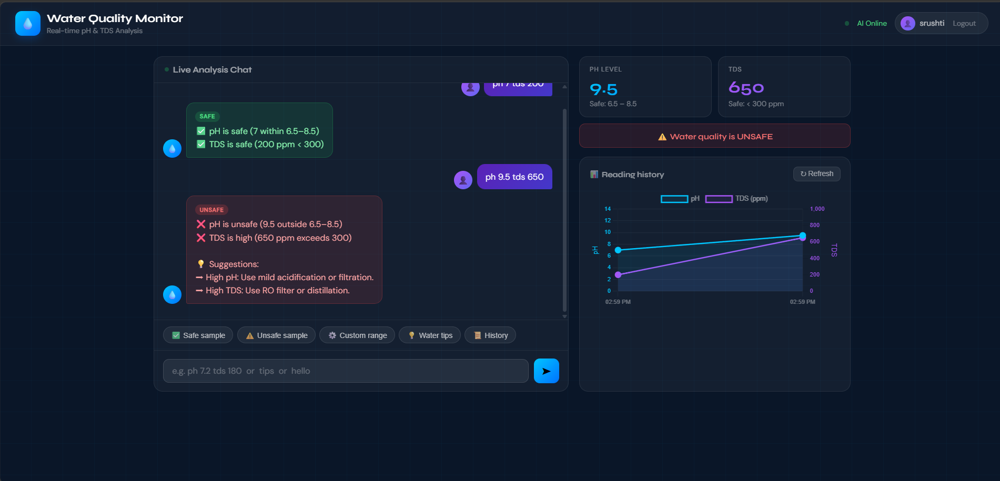
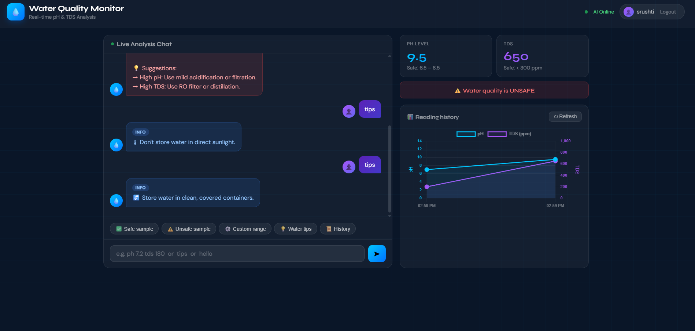

# 💧 Water Quality Monitor

A modern web-based application that analyzes water quality using **pH** and **TDS (Total Dissolved Solids)** values. The system provides real-time water safety assessment, recommendations, graphical visualization, and history tracking to help users determine whether water is safe for consumption.

---

## 🚀 Features

- 🔐 User Authentication (Sign In / Sign Up)
- 💧 Real-Time pH & TDS Analysis
- ✅ Safe Water Detection
- ⚠️ Unsafe Water Detection with Suggestions
- 🤖 AI-Powered Water Quality Assistant
- 📊 Interactive Reading History Charts
- 💡 Water Safety Tips
- 📜 Session History Tracking
- 🎨 Modern Responsive UI

---

## 🛠️ Technologies Used

- HTML5
- CSS3
- JavaScript
- Chart.js

---

## 📸 Screenshots

### 1️⃣ Sign In Page

*Secure login interface with demo credentials support.*

---

### 2️⃣ Main Dashboard

*Interactive dashboard showing live analysis chat, pH level, TDS level, and reading history.*

---

### 3️⃣ Safe Water Analysis

*Water sample with pH 7 and TDS 200 ppm successfully identified as safe.*

---

### 4️⃣ Unsafe Water Analysis

*Water sample with pH 9.5 and TDS 650 ppm detected as unsafe, with corrective suggestions.*

---

### 5️⃣ Water Quality Tips

*AI assistant provides useful recommendations and water safety guidelines.*

---

## 🔑 Demo Credentials

**Email:** demo@water.ai

**Password:** demo123

---

## 📊 Water Quality Standards

| Parameter | Safe Range |
|------------|------------|
| pH Level | 6.5 – 8.5 |
| TDS | Less than 300 ppm |

---

## ⚙️ How to Run

1. Download or clone the repository.
2. Open the project folder.
3. Launch the HTML file in a web browser.
4. Sign in using the demo account or create a new account.
5. Enter pH and TDS values to analyze water quality.
6. View real-time results, charts, and recommendations.

---

## 🎯 Future Enhancements

- IoT Sensor Integration
- Cloud Data Storage
- Mobile Application Support
- Real-Time Alerts
- Machine Learning Based Prediction
- Water Quality Report Generation

---

## 👨‍💻 Author

Developed as an Engineering Mini Project for Water Quality Monitoring and Analysis.
